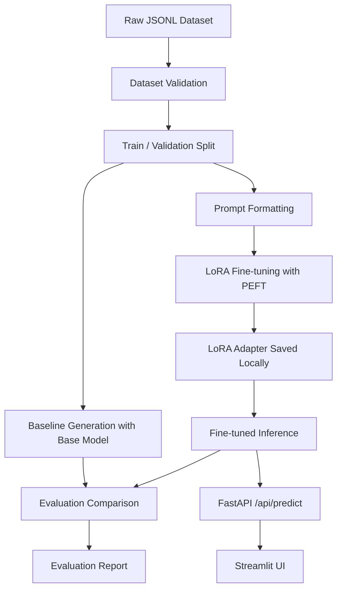

# Domain LoRA Fine-tuning Pipeline

A clean, educational, and practical GitHub project for fine-tuning a small open-source language model with **LoRA** on a domain-specific instruction dataset.

The example domain is **Customer Support Response Formatting**.

Given a customer complaint or question, the model is trained to produce a structured response with:

- `category`
- `priority`
- `suggested_reply`
- `next_action`

Example input:

```text
My order arrived damaged and I need a replacement.
```

Expected output:

```json
{
  "category": "Damaged Item",
  "priority": "High",
  "suggested_reply": "I'm sorry your order arrived damaged. We can help arrange a replacement as quickly as possible.",
  "next_action": "Create replacement request"
}
```

> This repository is designed as a learning reference. It includes a tiny sample dataset and lightweight training settings. It does **not** claim benchmark-level performance.

---

## 1. Project Overview

This project demonstrates a full LoRA fine-tuning workflow:

1. Prepare a small instruction dataset in JSONL format.
2. Validate the dataset schema.
3. Create train/validation splits.
4. Run the base model before fine-tuning.
5. Fine-tune the model using PEFT LoRA.
6. Evaluate structured outputs after fine-tuning.
7. Run inference from the command line.
8. Serve inference through FastAPI.
9. Use a simple Streamlit UI.
10. Test key utilities with pytest.

The goal is to show how a model can be adapted to follow a specific response format for a practical domain task.

---

## 2. Problem Statement

General-purpose language models can answer many questions, but they do not always produce outputs in the exact structure required by business workflows.

In customer support, teams often need outputs that are predictable and easy to integrate with internal systems. For example, a support assistant may need to classify a complaint, assign priority, draft a reply, and recommend the next operational step.

### Why fine-tuning is useful

Fine-tuning can improve model behavior when you need:

- Consistent response formatting
- Domain-specific tone or workflow behavior
- Repeated task patterns
- Smaller prompts at inference time
- Better alignment with internal examples

### When fine-tuning is better than prompting

Fine-tuning is often better than prompting when:

- You have many examples of the desired behavior.
- The output format must be consistent.
- Prompt-only solutions keep failing on edge cases.
- You want the model to learn a repeated task style.
- You need to reduce long prompt instructions.

### When RAG is better than fine-tuning

RAG is usually better when:

- The model needs fresh or changing knowledge.
- Answers must be grounded in documents.
- You need citations.
- The task depends on large external knowledge sources.
- You do not want to encode facts into model weights.

A simple rule:

- Use **fine-tuning** to teach behavior, format, and style.
- Use **RAG** to provide external knowledge and citations.
- Use both when the model needs a learned workflow and grounded context.

---

## 3. What This Project Demonstrates

This repository demonstrates:

- Instruction dataset preparation
- Dataset schema validation
- Train/validation splitting
- Baseline model generation before training
- LoRA fine-tuning with Hugging Face Transformers
- PEFT adapter-based training
- Structured output parsing
- Simple local evaluation metrics
- FastAPI inference deployment
- Streamlit UI deployment
- Testable, modular project structure

---

## 4. Simple Explanation of LoRA

**LoRA** stands for **Low-Rank Adaptation**.

Instead of updating all model weights during fine-tuning, LoRA freezes the original model and trains small additional adapter matrices inside selected layers.

This makes training:

- Cheaper
- Faster
- Smaller to store
- Easier to share
- Easier to swap between tasks

The base model remains unchanged. The trained LoRA adapter contains only the task-specific changes.

---

## 5. Simple Explanation of PEFT

**PEFT** means **Parameter-Efficient Fine-Tuning**.

PEFT is a family of methods that adapt large models by training only a small number of parameters. LoRA is one of the most popular PEFT methods.

This project uses the Hugging Face `peft` library to:

- Create a LoRA configuration
- Attach LoRA adapters to the base model
- Train only adapter parameters
- Save the adapter separately from the full model
- Load the adapter during inference

---

## 6. Architecture / Pipeline Diagram



---

## 7. Dataset Format

The dataset is stored in JSONL format:

```text
data/raw/sample_support_dataset.jsonl
```

Each row contains:

```json
{
  "instruction": "Classify the customer support message and return only valid JSON with exactly these fields: category, priority, suggested_reply, next_action.",
  "input": "My order arrived damaged and I need a replacement.",
  "output": "{\"category\":\"Damaged Item\",\"priority\":\"High\",\"suggested_reply\":\"I'm sorry your order arrived damaged...\",\"next_action\":\"Create replacement request\"}"
}
```

The `output` field is stored as a string containing valid JSON. This is common in instruction fine-tuning datasets because the model learns to generate that text.

---

## 8. Example Training Row

```json
{
  "instruction": "Classify the customer support message and return only valid JSON with exactly these fields: category, priority, suggested_reply, next_action.",
  "input": "I was charged twice for the same order.",
  "output": "{\"category\": \"Billing Issue\", \"priority\": \"High\", \"suggested_reply\": \"I'm sorry for the duplicate charge. We can review the transaction and help correct the billing issue.\", \"next_action\": \"Open billing investigation\"}"
}
```

---

## 9. Repository Structure

```text
domain-lora-finetuning-pipeline/
├── app/
│   ├── api/
│   │   ├── main.py
│   │   └── routes.py
│   ├── inference/
│   │   ├── predictor.py
│   │   └── formatting.py
│   └── schemas/
│       └── models.py
├── configs/
│   └── training_config.yaml
├── data/
│   ├── raw/
│   │   └── sample_support_dataset.jsonl
│   ├── processed/
│   │   └── .gitkeep
│   └── splits/
│       └── .gitkeep
├── notebooks/
│   └── 01_dataset_preview.ipynb
├── scripts/
│   ├── validate_dataset.py
│   ├── split_dataset.py
│   ├── run_baseline.py
│   ├── train_lora.py
│   ├── evaluate_model.py
│   └── run_inference.py
├── ui/
│   └── streamlit_app.py
├── outputs/
│   └── .gitkeep
├── tests/
├── Dockerfile
├── Makefile
├── requirements.txt
├── .env.example
├── .gitignore
└── README.md
```

---

## 10. Setup Instructions

### Create environment

```bash
python -m venv .venv
```

Activate it:

```bash
# macOS / Linux
source .venv/bin/activate

# Windows PowerShell
.venv\Scripts\Activate.ps1
```

Install dependencies:

```bash
pip install --upgrade pip
pip install -r requirements.txt
```

Optional:

```bash
cp .env.example .env
```

---

## 11. Hardware Notes

The default model in the config is:

```text
HuggingFaceTB/SmolLM2-135M-Instruct
```

This is intentionally small for demonstration.

### CPU demo limitations

CPU mode can run, but it may be slow. It is useful for:

- Dataset validation
- Splitting
- Unit tests
- Small baseline generation
- Very small training experiments

### GPU recommendation

A CUDA GPU is recommended for training, even for small models. GPU training is faster and more practical when increasing dataset size, sequence length, or training steps.

This repository does not include large model files or checkpoints. Generated adapters and outputs should be stored externally or ignored by Git.

---

## 12. Training Steps

### Step 1: Validate dataset

```bash
python scripts/validate_dataset.py \
  --data data/raw/sample_support_dataset.jsonl \
  --report outputs/dataset_validation_report.json
```

Or:

```bash
make validate
```

### Step 2: Split dataset

```bash
python scripts/split_dataset.py \
  --data data/raw/sample_support_dataset.jsonl \
  --train-out data/splits/train.jsonl \
  --validation-out data/splits/validation.jsonl
```

Or:

```bash
make split
```

### Step 3: Run baseline

```bash
python scripts/run_baseline.py \
  --config configs/training_config.yaml \
  --limit 5
```

This saves base model outputs to:

```text
outputs/baseline_outputs.jsonl
```

### Step 4: Train LoRA adapter

```bash
python scripts/train_lora.py --config configs/training_config.yaml
```

The adapter is saved to:

```text
outputs/lora_adapter/
```

Do not commit adapter checkpoints to GitHub.

### Step 5: Evaluate

```bash
python scripts/evaluate_model.py \
  --config configs/training_config.yaml \
  --limit 5
```

This saves:

```text
outputs/finetuned_outputs.jsonl
outputs/evaluation_report.json
```

### Step 6: Run inference

```bash
python scripts/run_inference.py \
  --text "My order arrived damaged and I need a replacement."
```

---

## 13. API Usage

Start the FastAPI server:

```bash
uvicorn app.api.main:app --reload --host 0.0.0.0 --port 8000
```

Health check:

```bash
curl http://localhost:8000/health
```

Prediction request:

```bash
curl -X POST "http://localhost:8000/api/predict" \
  -H "Content-Type: application/json" \
  -d '{"text":"My order arrived damaged and I need a replacement."}'
```

Example response shape:

```json
{
  "prediction": {
    "category": "Damaged Item",
    "priority": "High",
    "suggested_reply": "I'm sorry your order arrived damaged...",
    "next_action": "Create replacement request"
  },
  "raw_output": "...",
  "model_info": {
    "base_model_name": "HuggingFaceTB/SmolLM2-135M-Instruct",
    "adapter_path": "outputs/lora_adapter",
    "device": "cpu"
  }
}
```

---

## 14. UI Usage

Start the API first:

```bash
uvicorn app.api.main:app --reload
```

Then start Streamlit:

```bash
streamlit run ui/streamlit_app.py
```

Open the local Streamlit URL in your browser, enter a customer complaint, and generate a structured response.

---

## 15. Metrics Explanation

This project includes simple local metrics for structured output quality.

### Valid JSON rate

Measures the percentage of model outputs that contain a valid JSON object.

Example:

```text
valid_json_rate = valid_json_outputs / total_outputs
```

### Field completeness

Measures whether the required fields are present and non-empty:

- `category`
- `priority`
- `suggested_reply`
- `next_action`

### Category match

Compares the predicted `category` against the reference category in the validation examples.

This is a simple exact-match metric for the sample dataset. It is not a general benchmark.

---

## 16. Results

This repository intentionally does not include invented results.

Run the scripts locally to generate your own results:

```bash
make validate
make split
make baseline
make train
make evaluate
```

After evaluation, fill in this section with your own measured results:

| Run | Base Model | Adapter | Valid JSON Rate | Field Completeness | Category Match | Notes |
|---|---|---|---:|---:|---:|---|
| Local demo | `HuggingFaceTB/SmolLM2-135M-Instruct` | `outputs/lora_adapter` | TBD | TBD | TBD | Generated locally |

Evaluation report path:

```text
outputs/evaluation_report.json
```

---

## 17. Limitations

- The included dataset is tiny and only for demonstration.
- The model may still produce invalid JSON on some inputs.
- The category labels are simple and not exhaustive.
- Fine-tuning on a small dataset can overfit quickly.
- CPU training is slow and should only be used for lightweight tests.
- The project does not include production monitoring or authentication.
- The metrics are basic local checks, not formal benchmarks.

---

## 18. Future Improvements

Possible improvements:

- Add a larger and more diverse support dataset.
- Add stricter JSON schema-constrained decoding.
- Add more categories and priority rules.
- Add human review workflows for high-priority cases.
- Add MLflow experiment tracking.
- Add Docker Compose for API and UI.
- Add CI with pytest and linting.
- Add quantized inference for smaller hardware.
- Add model card and dataset card.
- Add more robust evaluation with human review.

---

## 19. Interview Talking Points

You can explain the project using these points:

- The project fine-tunes a small open-source language model for a structured customer support task.
- It uses an instruction dataset with `instruction`, `input`, and `output` fields.
- It first runs a baseline model to compare behavior before training.
- It uses LoRA to train a small adapter instead of updating all model weights.
- It saves the adapter separately from the base model.
- It evaluates output structure using valid JSON rate, field completeness, and category match.
- It exposes inference through both a CLI and FastAPI endpoint.
- It includes a Streamlit UI for simple testing.
- It avoids committing checkpoints or generated outputs to GitHub.

---

## How to Explain This Project in an Interview

This project demonstrates how to fine-tune a language model using LoRA for a structured domain task. It includes dataset preparation, baseline comparison, adapter training, evaluation, and deployment through an API and UI. The goal is not to memorize facts, but to improve task behavior and output formatting.

A strong interview explanation:

> I built a LoRA fine-tuning pipeline for customer support response formatting. The model receives a complaint and returns structured JSON containing a category, priority, suggested reply, and next action. I included dataset validation, train/validation splitting, baseline generation, PEFT LoRA training, structured-output evaluation, and deployment through FastAPI and Streamlit. The important idea is that fine-tuning is used here to improve task behavior and formatting consistency, not to store changing knowledge. For changing knowledge, I would use RAG instead.

---

## GitHub Notes

Do not upload large model files, checkpoints, or generated outputs to GitHub.

The `.gitignore` file excludes:

- `outputs/**`
- model checkpoint files
- adapter model files
- logs
- local environments

Recommended storage options for real model artifacts:

- Hugging Face Hub
- S3-compatible object storage
- Azure Blob Storage
- Google Cloud Storage
- Private model registry

---

## Quick Command Summary

```bash
make install
make validate
make split
make baseline
make train
make evaluate
make infer
make api
make ui
make test
```
